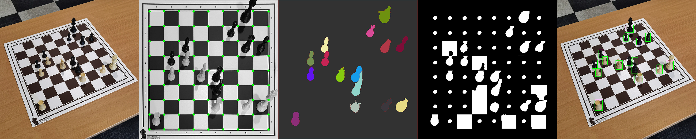
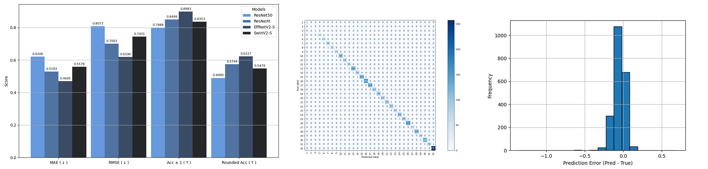
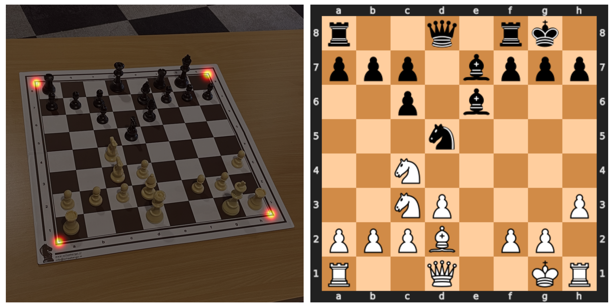

# Chessboard Analysis with Computer Vision

> **Project**
> <br />
> Course Unit: [Computer Vision](https://sigarra.up.pt/feup/en/ucurr_geral.ficha_uc_view?pv_ocorrencia_id=542589 "Visão Computacional"), 1nd year
> <br />
> Course: [Master in Artificial Intelligence](https://sigarra.up.pt/feup/en/cur_geral.cur_view?pv_curso_id=30901)
> <br />
> Faculty: **FEUP** (Faculty of Engineering of the University of Porto)
> <br />
> Assessment: ([PDF](./docs/assessment.pdf))
> <br />
> Report **(Task 1)**: [Classical CV Approach](./docs/task1_report.pdf)
> <br />
> Report **(Tasks 2 & 3):** [Deep Learning Approach](./docs/task_2_3_report.pdf)
> <br />
> Project evaluation: **20**/20

---

## Project Goals

Analyzing chessboard images to extract piece positions and reconstruct the full game state. Both classical computer vision and deep learning methods were explored.

**The three tasks:**
- **Task 1:** Classical CV approach using OpenCV for board detection and piece ocupacion identification
- **Task 2:** Deep learning regression model for accurate piece counting
- **Task 3:** Full pipeline combining YOLO object detection with board geometry estimation to generate FEN notation and digital twin representation

## Technical approach

### Task 1: Classical computer vision approach

For Task 1, we focused on building a classical computer vision pipeline using OpenCV to detect the board, identify its orientation, extract the grid, and localize pieces. 

1. **Finding the board:** We combined two separate methods **Canny edge detection** and **white color thresholding** and merged their results by intersecting their largest contours. This made the detection more resilient to lighting conditions and noise.

2. **Contour merging:**  We used an iterative merging process based on convex hull proximity

3. **Grid extraction:** After perspective correction, Hough Line Transform found most of the grid lines. For missing lines, we calculated the median spacing and filled in the gaps.

4. **Piece detection:** For detecting pieces, we combined GrabCut segmentation with hint masks for each square, followed by watershed transforms. Bounding boxes were then mapped back to the original image coordinates.

5. **Orientation detection:** Using template matching on the horse logo, we determined the board's orientation by checking the four corners of the warped image.




### Task 2: Deep Learning Regression for Piece Counting

For this task, the goal was to develop a regression model capable of accurately predicting the number of chess pieces on the board. The approach began with a baseline model which was iteratively improved through a series of experiments.

Our initial setup consisted of:
* **Base Model**: ResNet50 with pre-trained PyTorch weights.
* **Loss Function**: Mean Squared Error (MSE).
* **Optimizer**: AdamW with a learning rate of $1 \times 10^{-4}$ and weight decay of 0.01.
* **Activation Function**: A sigmoid function, `out = 30 * σ(x) + 2`, was used to constrain the output to the valid range of pieces, [2, 32].
* **Training**: The model was fine-tuned for 30 epochs with images resized to 256x256 and cropped to 224x224.

A "greedy-like" methodology was adopted, where successful improvements were carried over to subsequent experiments. This iterative refinement process involved exploring different architectures, data augmentation techniques, activation functions, loss functions, and hyperparameter tuning.

#### **Experimental Improvements**

1.  **Data Augmentation**:
    * **Manual Augmentations**: Initially, manual augmentations such as rotation, random perspective distortions, Gaussian blur, and color jitter were introduced. This improved the Mean Absolute Error (MAE) from 0.73 to 0.62.
    * **Automatic Augmentations**: Subsequently, automatic augmentation techniques were tested. **RandAugment**, which randomly applies a set of augmentations, demonstrated superior performance compared to manual methods and AutoAugment, and was adopted for later experiments.

2.  **Model Architecture**:
    * Several architectures were compared, including `ResNet 50`, `ResNeXt-101 64x4d`, `EfficientNet V2 Small`, and `Swin Transformer V2 Small`.
    * The **EfficientNet V2-S** model consistently showed the best performance and was selected as the primary model for further tuning.

3.  **Activation and Loss Functions**:
    * The initial sigmoid activation was replaced with a plain ReLU, which improved results. Performance was further enhanced by adding learnable scaling and bias parameters to the ReLU activation (`out = scaling * ReLU(x) + bias`).
    * Different regression-based loss functions were tested. Both **L1Loss** (based on MAE) and **SmoothL1Loss** outperformed the original MSELoss.

4.  **Hyperparameter Tuning**:
    * The `optuna` package was used for comprehensive hyperparameter tuning over 50 trials.
    * The best configuration found was:
        * **Loss Function**: L1Loss
        * **Learning Rate**: $5.26 \times 10^{-4}$
        * **Weight Decay**: 0.0326
        * **Scheduler**: Cosine Annealing


This model achieved the following results results:
* **Validation Set**: 0.0027 rounded values MAE.
* **Test Set**: 0.0056 rounded values MAE.

Interestingly, the YOLOv8x model developed for Task 3, while not specifically designed for counting, achieved a plain validation MAE of 0.0233 without rounding, outperforming the dedicated regression models in that specific scenario, likely due to its larger size and robust training. However, with the rounding strategy, the specialized EfficientNetV2-S model remained superior for this task.




### Task 3: Bounding Box Detection and Digital Twin Extraction

The final and most complex task was to create a complete pipeline that takes a chessboard image and produces a full digital twin of the game state. This involved two main components: accurately detecting the bounding boxes and classes of all pieces on the board, and determining the board's geometry to map those pieces to their correct squares. The final output is a Forsyth-Edwards Notation (FEN) string, a standard text format that represents the board state. 

Our approach evolved significantly as we encountered challenges, moving from traditional computer vision techniques to more robust deep learning models for board analysis. The piece detection itself was handled by the powerful YOLO object detection model. 

#### **1. Bounding Box Detection with YOLO**

To identify and locate each chess piece, we used the You Only Look Once (YOLO) architecture, using the Ultralytics framework. We experimented with several YOLO variants, including YOLOv8n, YOLOv8x, and YOLO-L1s, training each for 100 epochs on the ChessRed dataset. 

* **Models Trained**: YOLOv8n, YOLOv8x, YOLO-L1s. 
* **Performance Metric**: Mean Average Precision (mAP) at IoU thresholds of 50% (mAP50) and 50-95% (mAP50-95). 

The **YOLOv8x** model emerged as the top performer, achieving a **mAP50 of 0.995** and a **mAP50-95 of 0.875**, and was therefore chosen for the final pipeline. 

| Model | mAP50 | mAP50-95 |
| :--- | :--- | :--- |
| **YOLOv8x** | **0.995** | **0.875** |
| YOLOv11s | 0.995 | 0.873 |
| YOLOv8n | 0.995 | 0.865 |

#### **2. Digital Twin Extraction and Board Geometry**

An initial end-to-end approach to classify each square directly proved to be unreliable, performing poorly on complex board states. This led us to develop a multi-step pipeline where piece detection and board geometry estimation were handled separately. The core challenge became accurately finding the four corners of the chessboard to perform a perspective warp. We explored five distinct strategies for this:

* **Approach A: Traditional CV**
    This method combined YOLO for piece detection with the classical computer vision techniques explored for task 1(Canny edge detection, polygon approximation) to find board corners. This approach struggled with occlusion and difficult lighting.

* **Approach B: YOLO Keypoint Detection**
    We trained a YOLOv11-pose model to detect the board and its four corners as keypoints. However, the model failed to converge on precise corner locations, making it too unreliable for the pipeline. 

* **Approach C: CNN for Corner Regression**
    We shifted to using a pre-trained CNN to directly regress the corner coordinates. An initial attempt with ResNet50 yielded poor results. Performance significantly improved by switching to an **EfficientNetV2-S** backbone, fine-tuning all layers, and introducing robust data augmentations using `tv_tensors.KeyPoints` to handle coordinate transformations. This improved model achieved a Mean Euclidean Distance (MED) of **0.45%** on the test set. 

* **Approach D: UNet (Segmentation) + ResNet (Orientation)**
    This strategy involved two models: a U-Net to create a binary segmentation mask of the board, from which corners were extracted, and a separate ResNet classifier to determine the board's orientation (0°, 90°, 180°, or 270°). This method achieved a MED of **0.49%** on the test set. 

* **Approach E: UNet for Corner Heatmaps**
    The most successful approach involved training a U-Net with a pre-trained ResNet34 encoder to predict four heatmaps, one for each corner. Instead of regressing exact coordinates, this model predicts a probability distribution for each corner's location, making it more robust to ambiguity. The final corner prediction is the brightest point in each heatmap. This method achieved the best performance with a **MED of 0.31%** on the test set. However, it sometimes struggled with assigning the correct label to each corner (e.g., confusing top-left with bottom-right). 

The final, most robust pipeline combined the **YOLOv8x model** for piece detection with the **UNet heatmap model** for corner detection. After identifying the pieces and warping the board based on the predicted corners, the center pixel of the lower half of each piece's bounding box was used to map it to the correct 8x8 grid square, from which the FEN string was generated. 



## Running the code

**Setup:**
```bash
git clone https://github.com/Minipoloalex/chessboard-computer-vision
cd chessboard-analysis
```

**Task 1 (Classical CV):**
```bash
python task1_classical_cv.py
```
Processes images from `input.json` and saves results to `output.json`.

**Task 2 (Piece counting):**
```bash
# Run inference with pre-trained model
python task2_piece_counter.py --mode task2-delivery

# Train a new model
python task2_piece_counter.py --mode train --type num-pieces --model-name my_counter
```

**Task 3 (Digital twin):**
```bash
jupyter notebook task3_digital_twin.ipynb
```
The notebook walks through all our experiments and the final pipeline.

## Tech stack

Python, PyTorch, Ultralytics YOLO, OpenCV, NumPy, Scikit-learn, Optuna, Matplotlib

## Team

- Adriano Machado (202105352)
- Félix Martins (202108837)  
- Francisco da Ana (202108762)
- João Torre Pereira (202108848)
